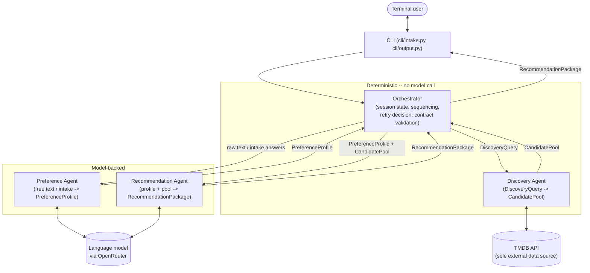
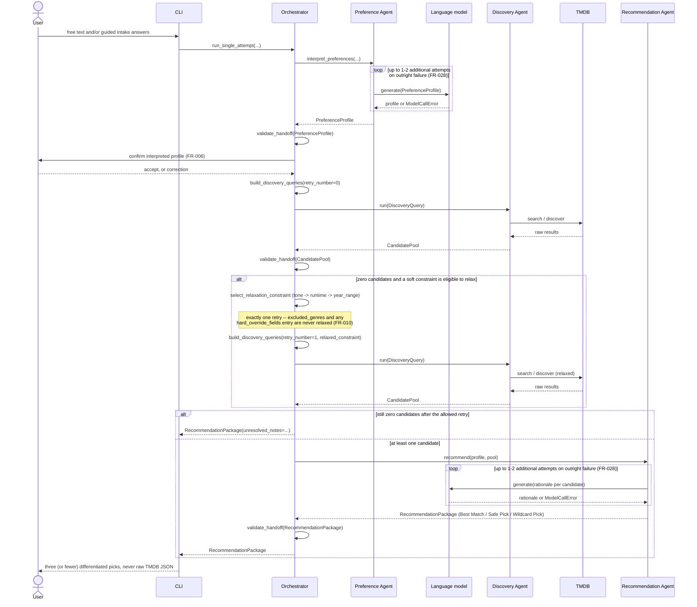

# Architecture

Two diagrams: the static component/contract architecture, and the runtime
sequence for a single request, including both bounded retry paths (the
discovery zero-result retry and the independent LLM-call retry). See
`CLAUDE.md` and `specs/001-streaming-discovery-assistant/contracts/*.md`
for the full behavioral guarantees behind each box below.

## Component architecture

Four components hand off validated Pydantic contracts in a straight
pipeline. Only the Preference Agent and Recommendation Agent call a
language model; the Orchestrator and Discovery Agent are 100%
deterministic (constitution Principle II, spec NFR-008) — that boundary is
enforced, not incidental.

Every arrow labeled with a contract name is a validated Pydantic model
(`src/streaming_discovery/contracts/`); a handoff that fails validation is
raised as a `ContractValidationError`, never coerced around.

## Sequence: one request, both retry paths

The two retries are bounded and independent of each other: **exactly one**
discovery retry (FR-011) with deterministic soft-constraint relaxation, and
**1–2** LLM-call retries (FR-028) on an outright model failure, wherever a
model is called.

A TMDB adapter error at either discovery step short-circuits immediately
with a controlled `unresolved_notes` message (FR-027) rather than
continuing to the retry or to recommendation — not shown above as a
separate branch for clarity, but see `contracts/discovery-agent.md`.
